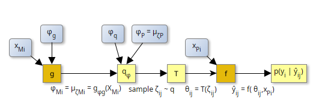

# HybridVariationalInference HVI

Estimating uncertainty in hybrid models, 
i.e. models that combine mechanistic and machine-learning parts,
by extending Variational Inference (VI), an approximate bayesian inversion method.

## Problem

Consider the case of Parameter learning, a special case of hybrid models, 
where a machine learning model, $g_{\phi_g}$, uses known covariates $x_{Mi}$ at site $i$,
to predict a subset of the parameters, $\theta$ of the process based model, $f$.

The analyst is interested in both,
- the uncertainty of hybrid model predictions, $ŷ$ (predictive posterior), and
- the uncertainty of process-model parameters $\theta$, including their correlations
  (posterior)

For example consider a soil organic matter process-model that predicts carbon stocks for 
different sites. We need to parameterize the unknown carbon use efficiency (CUE) of the soil
microbial community that differs by site, but is hypothesized to correlate with climate variables
and pedogenic factors, such as clay content.
We apply a machine learning model to estimate CUE and fit it end-to-end with other
parameters of the process-model to observed carbon stocks.
In addtion to the predicted CUE, we are interested in the uncertainty of CUE and its correlation 
with other parameters. 
We are interested in the entire posterior probability distribution of the model parameters.

To understand the background of HVI, refer to the [documentation]((https://EarthyScience.github.io/HybridVariationalInference.jl/dev/)).

## Usage

In order to apply HVI, the user has to construct a `HybridProblem` object by specifying
- the machine learning model, $g$
- covariates $X_{Mi}$ for each site, $i$
- the names of parameters that differs across sites, $\theta_M$, and global parameters
  that are the same across sites, $\theta_P$
  - optionally, sub-blocks in the within-site correlation structure of the parameters
  - optionally, which global parameters should be provided to $g$ as additional covariates,
    to account for correlations between global and site parameters
- the parameter transformations from unconstrained scale to the scale relevant to the process models, $\theta = T(\zeta)$, e.g. for strictly positive parameters specify `exp`.
- the process-model, $f$
- drivers of the process-model $X_{Pi}$ at each site, $i$
- the likelihood function of the observations, given the model predictions, $p(y|ŷ, \theta)$

Next this problem is passed to a `HybridPosteriorSolver` that fits an approximation
of the posterior. It returns a NamedTuple of
- `ϕ`: the fitted parameters, a ComponentVector with components
  - the machine learning model parameters (usually weights), $\phi_g$
  - means of the global parameters, $\phi_P = \mu_{\zeta_P}$ at transformed 
    unconstrained scale
  - additional parameters, $\phi_{unc}$ of the posterior, $q(\zeta)$, such as 
    coefficients that describe the scaling of variance with magnitude 
    and coefficients that parameterize the choleski-factor or the correlation matrix.
- `θP`: predicted means of the global parameters, $\theta_P$ 
- `resopt`: the original result object of the optimizer (useful for debugging)

TODO to get
- means of the site parameters for each site
- samples of posterior
- samples of predictive posterior
## Example
TODO

see test/test_HybridProblem.jl

