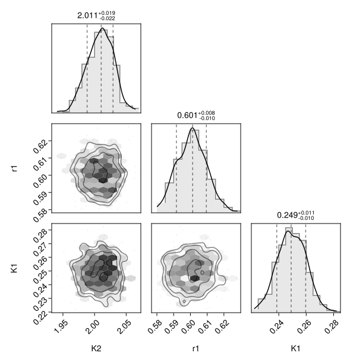
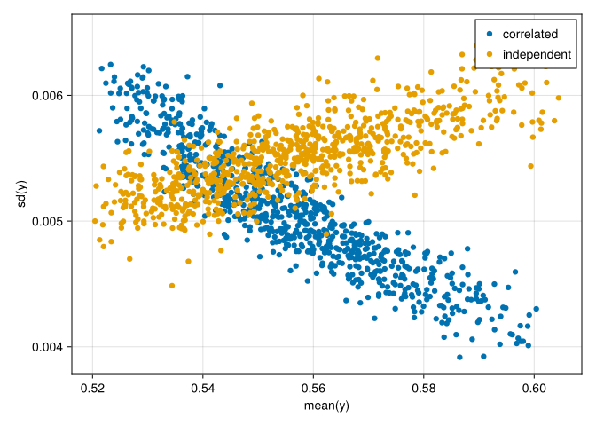

# How to model independent parameter-blocks in the posterior


``` @meta
CurrentModule = HybridVariationalInference  
```

This guide shows how to configure independent parameter-blocks in the correlations
of the posterior.

## Motivation

Modelling all correlations among global and site PBM-parameters respectively
requires many degrees of freedom.

To decrease the number of parameters to estimate, HVI allows to decompose the
correlations into independent sub-blocks of parameters.

First load necessary packages.

``` julia
using HybridVariationalInference
using ComponentArrays: ComponentArrays as CA
using Bijectors
using SimpleChains
using MLUtils
using JLD2
using Random
using CairoMakie
using PairPlots   # scatterplot matrices
```

This tutorial reuses and modifies the fitted object saved at the end of the
[Basic workflow without GPU](@ref) tutorial.

``` julia
fname = "intermediate/basic_cpu_results.jld2"
print(abspath(fname))
prob = probo_cor = load(fname, "probo");
```

## Specifying blocks in correlation structure

HVI models the posterior of the parameters at unconstrained scale using a
multivariate normal distribution. It estimates a parameterization of the
associated blocks in the correlation matrx and requires a specification
of the block-structure.

This is done by specifying the positions of the end of the blocks for
the global (P) and the site-specific parameters (M) respectively using
a `NamedTuple` of integer vectors.

The defaults specifies a single entry, meaning, there is only one big
block respectively, spanning all parameters.

``` julia
pt = get_hybridproblem_par_templates(prob)
cor_ends0 = (P=[length(pt.θP)], M=[length(pt.θM)])
```

    (P = [1], M = [2])

The following specification models one-entry blocks for each each parameter
in the correlation block the site parameters, i.e. treating all parameters
independently with not modelling any correlations between them.

``` julia
cor_ends = (P=[length(pt.θP)], M=1:length(pt.θM))
```

    (P = [1], M = 1:2)

## Update the problem and redo the inversion

``` julia
prob_ind = HybridProblem(prob; cor_ends)
```

HVI uses additional fitted parameters to represent the means and the
covariance matrix of the posterior distribution of model parameters.
With fewer correlations, also the correlation parameters changes.

Check that the new specification uses fewer parameters.

``` julia
length(get_hybridproblem_ϕq(prob)), length(get_hybridproblem_ϕq(prob_ind))
```

    (7, 6)

``` julia
using OptimizationOptimisers
import Zygote

solver = HybridPosteriorSolver(; alg=Adam(0.02), n_MC=3)

(; probo) = solve(prob_ind, solver; 
    callback = callback_loss(100), # output during fitting
    epochs = 20,
); probo_ind = probo;
```

## Compare the correated vs. uncorrelated posterior

First, draw a sample.

``` julia
n_sample_pred = 400
(y_cor, θsP_cor, θsMs_cor) = (; y, θsP, θsMs) = predict_hvi(
  Random.default_rng(), probo_cor; n_sample_pred)
(y_ind, θsP_ind, θsMs_ind) = (; y, θsP, θsMs) = predict_hvi(
  Random.default_rng(), probo_ind; n_sample_pred)
```

``` julia
i_site = 1
θ1 = vcat(θsP_ind, θsMs_ind[i_site,:,:])
θ1_nt = NamedTuple(k => CA.getdata(θ1[k,:]) for k in keys(θ1[:,1])) # 
plt = pairplot(θ1_nt)
```



The corner plot of the independent-parameters estimate shows
no correlations between site parameters, *r*₁ and *K*₁.

``` julia
i_out = 4
fig = Figure(); ax = Axis(fig[1,1], xlabel="mean(y)",ylabel="sd(y)")
ymean_cor = [mean(y_cor[i_out,s,:]) for s in axes(y_cor, 2)]
ysd_cor = [std(y_cor[i_out,s,:]) for s in axes(y_cor, 2)]
scatter!(ax, ymean_cor, ysd_cor, label="correlated") 
ymean_ind = [mean(y_ind[i_out,s,:]) for s in axes(y_ind, 2)]
ysd_ind = [std(y_ind[i_out,s,:]) for s in axes(y_ind, 2)]
scatter!(ax, ymean_ind, ysd_ind, label="independent") 
axislegend(ax, unique=true)
fig
```


``` julia
plot_sd_vs_mean = (par) -> begin
  fig = Figure(); ax = Axis(fig[1,1], xlabel="mean($par)",ylabel="sd($par)")
  θmean_cor = [mean(θsMs_cor[s,par,:]) for s in axes(θsMs_cor, 1)]
  θsd_cor = [std(θsMs_cor[s,par,:]) for s in axes(θsMs_cor, 1)]
  scatter!(ax, θmean_cor, θsd_cor, label="correlated") 
  θmean_ind = [mean(θsMs_ind[s,par,:]) for s in axes(θsMs_ind, 1)]
  θsd_ind = [std(θsMs_ind[s,par,:]) for s in axes(θsMs_ind, 1)]
  scatter!(ax, θmean_ind, θsd_ind, label="independent") 
  axislegend(ax, unique=true)
  fig
end
plot_sd_vs_mean(:K1)
```



The inversion that neglects correlations among site parameters results in
the same magnitude of estimated uncertainty of predictions.
However, the uncertainty of the model parameters is severely underestimated
in this example.
