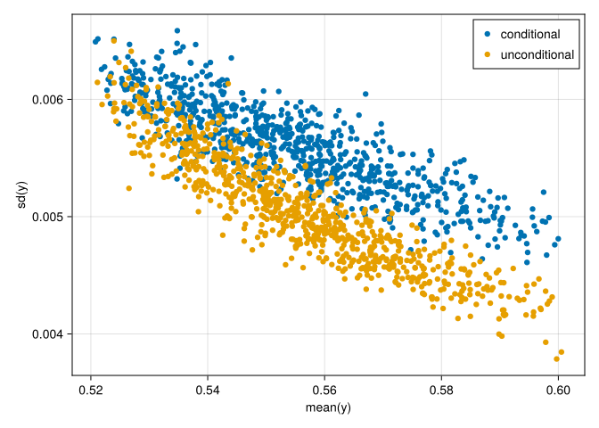
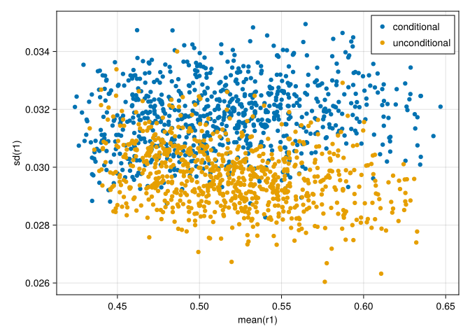
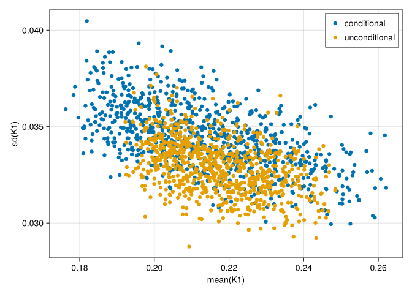

# How to account for correlations between site and global parameters


``` @meta
CurrentModule = HybridVariationalInference  
```

This guide shows how to configure providing certain global parameters as
covariates to the ML model.

## Motivation

HVI requires the site-parameter blocks in the correlation matrix to be
independent of the global-parameter block.

However, correlations between site and global parameters can be modeled
by predicting different (transformed) site parameters, $\zeta_{Ms}$
, given the sampled (transformed) global parameters, $\zeta_P$.

$$
p(\zeta_{Ms}, \zeta_P) = p(\zeta_{Ms} | \zeta_P) p(\zeta_P)$$

This comes at the cost of running the ML model forward for each sampled
global parameter, rather than just once in each sampling of the posterior.

First load necessary packages.

``` julia
using HybridVariationalInference
using ComponentArrays: ComponentArrays as CA
using Bijectors
using SimpleChains
using StatsFuns
using StableRNGs
using MLUtils
using JLD2
using Random
using CairoMakie
using PairPlots   # scatterplot matrices
```

This tutorial reuses and modifies the fitted object saved at the end of the
[Basic workflow without GPU](@ref) tutorial.

``` julia
fname = "intermediate/basic_cpu_results.jld2"
print(abspath(fname))
prob = probo_uncond = load(fname, "probo");
```

## The `pbm_covars` entry in the `HybridProblem`

When constructing a HybridProblem, the names of the subset of global parameters
provided to the ML model is specified using the `pbm_covars` argument.
It defaults to the empty tuple `()`,
meaning that no global parameters are provided as inputs.

The following specification tells, that the `K_2` parameter should be provided
as input to the ML model.

``` julia
pbm_covars = (:K2,)
```

## The modified Machine-Learning model

The ML model needs to be adapted to consume more inputs than the site covariates.
Note the changed `n_input` specification compared to the
[Basic workflow without GPU](@ref) tutorial.

``` julia
n_out = length(prob.θM) # number of individuals to predict 
n_covar = 5 #size(xM,1)
n_input = n_covar + length(pbm_covars)  
rng = StableRNG(111)

g_chain = SimpleChain(
    static(n_input), # input dimension (optional)
    TurboDense{true}(tanh, n_input * 4),
    TurboDense{true}(tanh, n_input * 4),
    # dense layer without bias that maps to n outputs to (0..1)
    TurboDense{false}(logistic, n_out)
)
# get a template of the parameter vector, ϕg0
g_chain_app, ϕg0 = construct_ChainsApplicator(rng, g_chain)
#
priorsM = [prob.priors[k] for k in keys(prob.θM)]
lowers, uppers = get_quantile_transformed(priorsM, prob.transM)
FT = eltype(prob.θM)
g_chain_scaled = NormalScalingModelApplicator(g_chain_app, lowers, uppers, FT)
```

## Update the problem and redo the inversion

``` julia
prob_cond = HybridProblem(probo_uncond; g=g_chain_scaled, ϕg=ϕg0, pbm_covars)
```

``` julia
using OptimizationOptimisers
import Zygote

solver = HybridPosteriorSolver(; alg=Adam(0.02), n_MC=3)

(; probo) = solve(probo_uncond, solver; 
    callback = callback_loss(100), # output during fitting
    epochs = 20,
); probo_cond = probo;
```

## Compare the conditional vs unconditional posterior

First, draw a sample.

``` julia
n_sample_pred = 400
(y_cond, θsP_cond, θsMs_cond) = (; y, θsP, θsMs) = predict_hvi(
  Random.default_rng(), probo_cond; n_sample_pred)
(y_uncond, θsP_uncond, θsMs_uncond) = (; y, θsP, θsMs) = predict_hvi(
  Random.default_rng(), probo_uncond; n_sample_pred)
```

``` julia
i_site = 1
θ1 = vcat(θsP_uncond, θsMs_uncond[i_site,:,:])
θ1_nt = NamedTuple(k => CA.getdata(θ1[k,:]) for k in keys(θ1[:,1])) # 
plt = pairplot(θ1_nt)
```


The corner plot of the independent-parameters estimate shows
that despite providing `K_2` to the ML model,
it has only very weak correlations with the site parameters, $r_1$ and $K_1$.

``` julia
i_out = 4
fig = Figure(); ax = Axis(fig[1,1], xlabel="mean(y)",ylabel="sd(y)")
ymean_cond = [mean(y_cond[i_out,s,:]) for s in axes(y_cond, 2)]
ysd_cond = [std(y_cond[i_out,s,:]) for s in axes(y_cond, 2)]
scatter!(ax, ymean_cond, ysd_cond, label="conditional") 
ymean_uncond = [mean(y_uncond[i_out,s,:]) for s in axes(y_uncond, 2)]
ysd_uncond = [std(y_uncond[i_out,s,:]) for s in axes(y_uncond, 2)]
scatter!(ax, ymean_uncond, ysd_uncond, label="unconditional") 
axislegend(ax, unique=true)
fig
```



``` julia
plot_sd_vs_mean = (par) -> begin
  fig = Figure(); ax = Axis(fig[1,1], xlabel="mean($par)",ylabel="sd($par)")
  θmean_cond = [mean(θsMs_cond[s,par,:]) for s in axes(θsMs_cond, 1)]
  θsd_cond = [std(θsMs_cond[s,par,:]) for s in axes(θsMs_cond, 1)]
  scatter!(ax, θmean_cond, θsd_cond, label="conditional") 
  θmean_uncond = [mean(θsMs_uncond[s,par,:]) for s in axes(θsMs_uncond, 1)]
  θsd_uncond = [std(θsMs_uncond[s,par,:]) for s in axes(θsMs_uncond, 1)]
  scatter!(ax, θmean_uncond, θsd_uncond, label="unconditional") 
  axislegend(ax, unique=true)
  fig
end
plot_sd_vs_mean(:r1)
```



``` julia
plot_sd_vs_mean(:K1)
```



The “conditional” scenario allows for correlations between global and site parameters
by making precitions of site parameters conditional on sampled global parameters.

It estimates slightly higher marginal uncertainties, both of the predictions
and of the model parameters.
