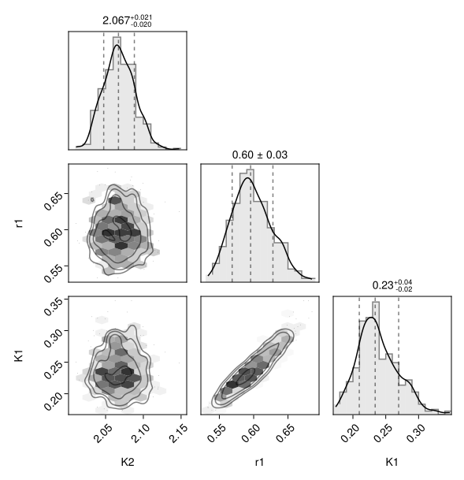
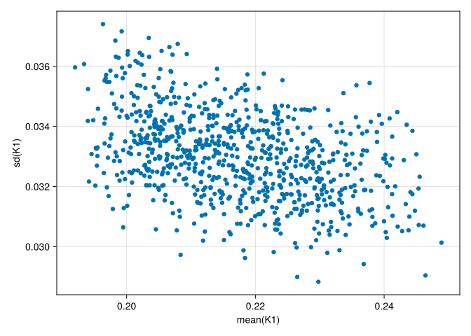
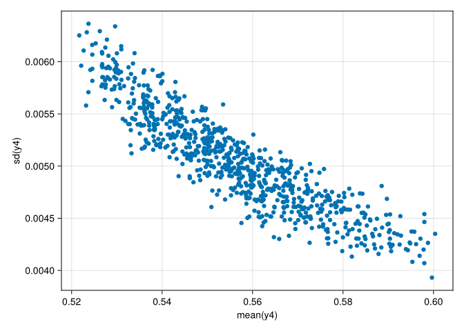

# Inspect results of fitted problem


``` @meta
CurrentModule = HybridVariationalInference  
```

This tutorial leads you through extracting relevant information from the
inversion results and to produce some typical plots.

First load necessary packages.

``` julia
using HybridVariationalInference
using StableRNGs
using ComponentArrays: ComponentArrays as CA
using SimpleChains # for reloading the optimized problem
using DistributionFits
using JLD2
using CairoMakie
using PairPlots   # scatterplot matrices
```

This tutorial uses the fitted object saved at the end of the
[Basic workflow without GPU](@ref) tutorial.

``` julia
fname = "intermediate/basic_cpu_results.jld2"
print(abspath(fname))
probo = load(fname, "probo");
```

## Sample the posterior

A sample of both, posterior, and predictive posterior can be obtained
using function [`sample_posterior`](@ref).

``` julia
using StableRNGs
rng = StableRNG(112)
n_sample_pred = 400
(; θsP, θsMs) = sample_posterior(rng, probo; n_sample_pred, is_testmode = true)
```

Lets look at the results.

``` julia
size(θsP), size(θsMs)
```

    ((1, 400), (800, 2, 400))

The last dimension is the number of samples, the second-last dimension is
the respective parameter. `θsMs` has an additional dimension denoting
the site for which parameters are samples.

They are ComponentArrays with the parameter dimension names that can be used:

``` julia
θsMs[1,:r1,:] # sample of r1 of the first site
```

## Corner plots

The relation between different variables can be well inspected by
scatterplot matrices, also called corner plots or pair plots.
`PairPlots.jl` provides a Makie-implementation of those.

Here, we plot the global parameters and the site-parameters for the first site.

``` julia
i_site = 1
θ1 = vcat(θsP, θsMs[i_site,:,:])
θ1_nt = NamedTuple(k => CA.getdata(θ1[k,:]) for k in keys(θ1[:,1])) # 
plt = pairplot(θ1_nt)
```



The plot shows that parameters for the first site, $K_1$ and $r_1$, are correlated,
but that we did not model correlation with the global parameter, $K_2$.

Note that this plots shows only the first out of 800 sites.
HVI estimated a 1602-dimensional posterior distribution including
covariances among parameters.

## Expected values and marginal variances

Lets look at how the estimated uncertainty of a site parameter changes with
its expected value.

``` julia
par = :K1
θmean = [mean(θsMs[s,par,:]) for s in axes(θsMs, 1)]
θsd = [std(θsMs[s,par,:]) for s in axes(θsMs, 1)]
fig = Figure(); ax = Axis(fig[1,1], xlabel="mean($par)",ylabel="sd($par)")
scatter!(ax, θmean, θsd) 
fig
```



We see that $K_1$ across sites ranges from about 0.18 to 0.25, and that
its estimated uncertainty is about 0.034, slightly decreasing with the
values of the parameter.

## Predictive Posterior

In addition to the uncertainty in parameters, we are also interested in
the uncertainty of predictions, i.e. the predictive posterior.

We cam either run the PBM for all the parameter samples that we obtained already,
using the [`AbstractPBMApplicator`](@ref), or use [`predict_hvi`](@ref) which combines
sampling the posterior and predictive posterior and returns the additional
`NamedTuple` entry `y`.

``` julia
(; y, θsP, θsMs) = predict_hvi(rng, probo; n_sample_pred)
```

``` julia
size(y)
```

    (8, 800, 400)

Again, the last dimension is the sample.
The other dimensions correspond to the observations we provided for the fitting:
The first dimension is the observation within one site, the second dimension is the site.

Lets look on how the uncertainty of the 4th observations scales with its
predicted magnitude across sites.

``` julia
i_obs = 4
ymean = [mean(y[i_obs,s,:]) for s in axes(θsMs, 1)]
ysd = [std(y[i_obs,s,:]) for s in axes(θsMs, 1)]
fig = Figure(); ax = Axis(fig[1,1], xlabel="mean(y$i_obs)",ylabel="sd(y$i_obs)")
scatter!(ax, ymean, ysd) 
fig
```



We see that observed values for associated substrate concentrations range about from
0.51 to 0.59 with an estimated standard deviation around 0.005 that decreases
with the observed value.
