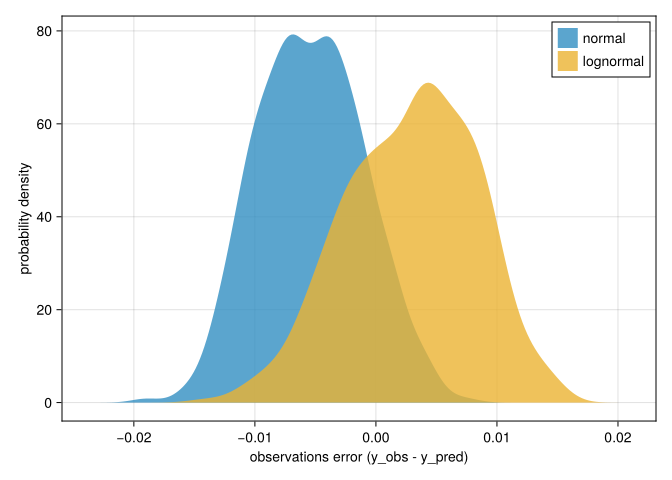
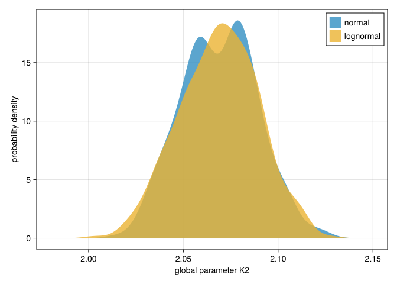
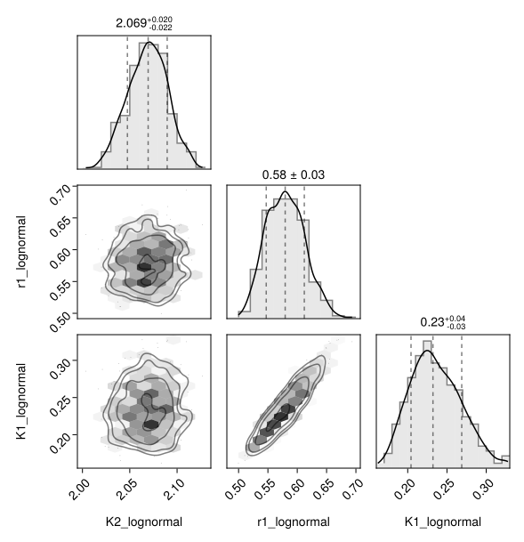
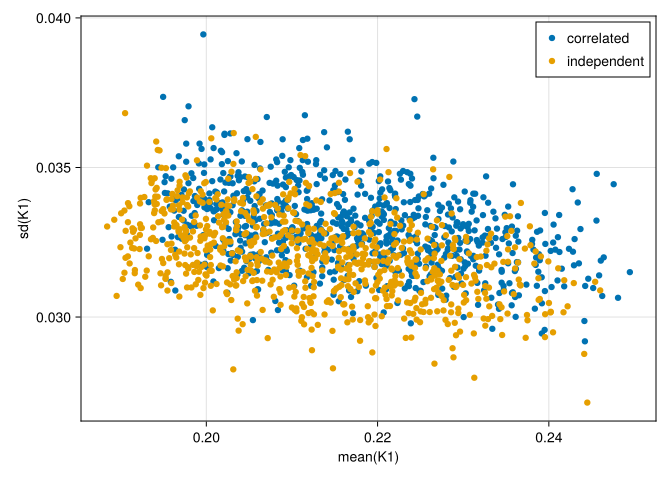

# How to specify a custom LogLikelihood of the observations


``` @meta
CurrentModule = HybridVariationalInference  
```

This guide shows how the user can specify a customized log-density function.

## Motivation

The loglikelihood function assigns a cost to the mismatch between predictions and
observations. This often needs to be customized to the specific inversion.

This guide walks through he specification of such a function and inspects
differences among two log-likelihood functions.
Specifically, it will assume observation errors to be independently distributed
according to a LogNormal distribution with a specified fixed relative error,
compared to an inversion assuming observation error to be distributed independently normal.

First load necessary packages.

``` julia
using HybridVariationalInference
using ComponentArrays: ComponentArrays as CA
using Bijectors
using SimpleChains
using MLUtils
using JLD2
using Random
using CairoMakie
using PairPlots   # scatterplot matrices
```

This tutorial reuses and modifies the fitted object saved at the end of the
[Basic workflow without GPU](@ref) tutorial, that used a log-Likelihood
function assuming observation error to be distributed independently normal.

``` julia
fname = "intermediate/basic_cpu_results.jld2"
print(abspath(fname))
prob = probo_normal = load(fname, "probo");
```

## Write the LogLikelihood Function

The function signature corresponds to the one of [`neg_logden_indep_normal`](@ref).
of signature

`neg_log_den_user(y_pred, y_obs, y_unc; kwargs...)`

It takes inputs of predictions, `y_pred`, observations, `y_obs`,
and uncertainties parameters, `y_unc` and returns the logarithm of the
likelihhood up to a constant.

All of the arguments are vectors of the same length specifying predictions and
observations for one site.
If `y_pred`, `y_obs` are given as a matrix of several column-vectors, their summed
Likelihood is computed.

The density of a LogNormal distribution is

$$
\frac{ 1 }{ x  \sqrt{2 \pi \sigma^2} } \exp\left( -\frac{ (\ln x-\mu)^2 }{2 \sigma^2} \right)$$

where x is the observation, μ is the log of the prediction, and σ is the scale
parameter that is related to the relative error, $c_v$ by $\sigma = \sqrt{ln(c^2_v + 1)}$.

Taking the log:

$$
 -ln x -\frac{1}{2} ln \sigma^2 -\frac{1}{2} ln (2 \pi) -\frac{ (\ln x-\mu)^2 }{2 \sigma^2}$$

Negating and dropping the constants $-\frac{1}{2} ln (2 \pi)$ and $-\frac{1}{2} ln \sigma^2$

$$
 ln x + \frac{1}{2} \left(\frac{ (\ln x-\mu)^2 }{\sigma^2} \right)$$

``` julia
function neg_logden_lognormalep_lognormal(y_pred, y_obs::AbstractArray{ET}, y_unc; 
  σ2 = log(abs2(ET(0.02)) + ET(1))) where ET
    lnx = log.(CA.getdata(y_obs))
    μ = log.(CA.getdata(y_pred))
    nlogL = sum(lnx .+ abs2.(lnx .- μ) ./ (ET(2) .* σ2))  
    #nlogL = sum(lnx + (log(σ2) .+ abs2.(lnx .- μ) ./ σ2) ./ ET(2)) # nonconstant σ2
    return (nlogL)
end
```

If information on the different relative error by observation was available,
we could pass that information using the DataLoader with `y_unc`, rather than
assuming a constant relative error across observations.

## Update the problem and redo the inversion

HybridProblem has keyword argument `py` to specify the function of negative Log-Likelihood.

``` julia
prob_lognormal = HybridProblem(prob; py = neg_logden_lognormalep_lognormal)

using OptimizationOptimisers
import Zygote

solver = HybridPosteriorSolver(; alg=Adam(0.02), n_MC=3)

(; probo) = solve(prob_lognormal, solver; 
    callback = callback_loss(100), # output during fitting
    epochs = 20,
); probo_lognormal = probo;
```

## Compare results between assumptions of observation error

First, draw a sample form the inversion assumping normal and a sample from
the inversion assuming loglornally distributed observation errors.

``` julia
n_sample_pred = 400
(y_normal, θsP_normal, θsMs_normal) = (; y, θsP, θsMs) = predict_hvi(
  Random.default_rng(), probo_normal; n_sample_pred)
(y_lognormal, θsP_lognormal, θsMs_lognormal) = (; y, θsP, θsMs) = predict_hvi(
  Random.default_rng(), probo_lognormal; n_sample_pred)
```

Get the original observations from the DataLoader of the problem, and
compute the residuals.

``` julia
train_loader = get_hybridproblem_train_dataloader(probo_normal; scenario=())
y_o = train_loader.data[3]
resid_normal = y_o .- y_normal
resid_lognormal = y_o .- y_lognormal
```

And compare plots of some of the results.

``` julia
i_out = 4
i_site = 1
fig = Figure(); ax = Axis(fig[1,1], xlabel="observations error (y_obs - y_pred)",ylabel="probability density")
#hist!(ax, resid_normal[i_out,i_site,:], label="normal", normalization=:pdf)
density!(ax, resid_normal[i_out,i_site,:], alpha = 0.8, label="normal")
density!(ax, resid_lognormal[i_out,i_site,:], alpha = 0.8, label="lognormal")
axislegend(ax, unique=true)
fig
```



The density plot of the observation residuals does not show the lognormal shape.
The used synthetic observations were actually noramally
distributed around predictions with true parameters.

How does the wrong assumption of observation error influence the parameter
posterior?

``` julia
i_site = 1
fig = Figure(); ax = Axis(fig[1,1], xlabel="global parameter K2",ylabel="probability density")
#hist!(ax, resid_normal[i_out,i_site,:], label="normal", normalization=:pdf)
density!(ax, θsP_normal[:K2,:], alpha = 0.8, label="normal")
density!(ax, θsP_lognormal[:K2,:], alpha = 0.8, label="lognormal")
axislegend(ax, unique=true)
fig
```



The marginal posterior of the global parameters is also similar, with a small
trend of lower values.

``` julia
i_site = 1
θln = vcat(θsP_lognormal, θsMs_lognormal[i_site,:,:])
θln_nt = NamedTuple(Symbol("$(k)_lognormal") => CA.getdata(θln[k,:]) for k in keys(θln[:,1])) # 
#θn = vcat(θsP_normal, θsMs_normal[i_site,:,:])
#θn_nt = NamedTuple(Symbol("$(k)_normal") => CA.getdata(θn[k,:]) for k in keys(θn[:,1])) # 
# ntc = (;θn_nt..., θln_nt...)
plt = pairplot(θln_nt)
```



The corner plot of the independent-parameters estimate  
looks similar and shows correlations between site parameters, $r_1$ and $K_1$.

``` julia
i_out = 4
fig = Figure(); ax = Axis(fig[1,1], xlabel="mean(y)",ylabel="sd(y)")
ymean_normal = [mean(y_normal[i_out,s,:]) for s in axes(y_normal, 2)]
ysd_normal = [std(y_normal[i_out,s,:]) for s in axes(y_normal, 2)]
scatter!(ax, ymean_normal, ysd_normal, label="normal") 
ymean_lognormal = [mean(y_lognormal[i_out,s,:]) for s in axes(y_lognormal, 2)]
ysd_lognormal = [std(y_lognormal[i_out,s,:]) for s in axes(y_lognormal, 2)]
scatter!(ax, ymean_lognormal, ysd_lognormal, label="lognormal") 
axislegend(ax, unique=true)
fig
```


The predicted magnitude of error in predictions for the fourth observation across sites
is of the same magnitude,
and still shows (although weaker) pattern of decreasing uncertainty with
increasing value.

``` julia
plot_sd_vs_mean = (par) -> begin
  fig = Figure(); ax = Axis(fig[1,1], xlabel="mean($par)",ylabel="sd($par)")
  θmean_normal = [mean(θsMs_normal[s,par,:]) for s in axes(θsMs_normal, 1)]
  θsd_normal = [std(θsMs_normal[s,par,:]) for s in axes(θsMs_normal, 1)]
  scatter!(ax, θmean_normal, θsd_normal, label="correlated") 
  θmean_lognormal = [mean(θsMs_lognormal[s,par,:]) for s in axes(θsMs_lognormal, 1)]
  θsd_lognormal = [std(θsMs_lognormal[s,par,:]) for s in axes(θsMs_lognormal, 1)]
  scatter!(ax, θmean_lognormal, θsd_lognormal, label="independent") 
  axislegend(ax, unique=true)
  fig
end
plot_sd_vs_mean(:K1)
```



For the assumed fixed relative error,the uncertainty in the model
parameters, $K_1$, across sites is similar to the uncertainty with normal log-likelihood.
