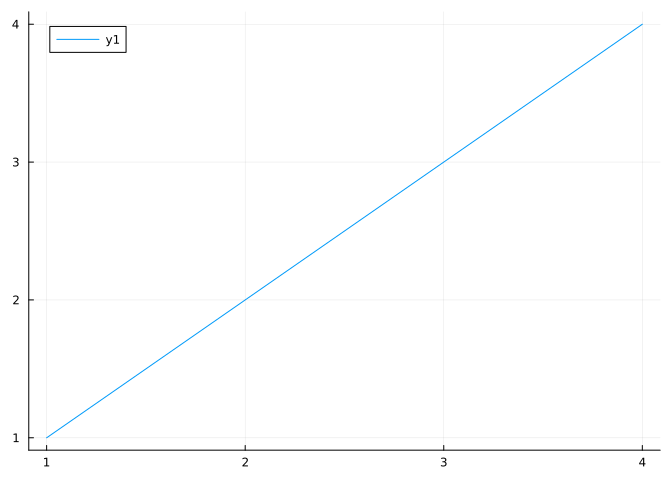

# A julia engine notebook


``` julia
2 + 2
```

    4

A code block with `#| echo: false`.

    Status `/Net/Groups/BGI/people/twutz/julia/dev/HybridVariationalInference/docs/src_stash/Project.toml`
      [91a5bcdd] Plots v1.40.19

``` julia
run(`which julia`);
```

    /Net/Groups/Services/HPC_22/apps/julia/julia-1.11.4/bin/julia

## Equation

inline: $\sqrt{\pi}$ inside text.

display equation [Equation 1](#eq-general) with a number and a reference

$$
\begin{aligned}
\frac{n!}{k!(n - k)!} &= \binom{n}{k}
\\
x^2 =& 3
\end{aligned}
 \qquad(1)$$

## Literature references

See (Wutzler et al. 2020).

## Plots

single

``` julia
plot(1:4)
```



## Not working with Documenter

Julia code is not colored, output block-code

Figures: The figure captions are not kept, and links do not work

References: the number is correctly inserted, but the link does not work

Documenter admonitions: the four spaces before the contents are removed - do not work

Quarto-Columns are rendered to several paragraphs

With gfm, references are formatted bad, and there are errors with unclosed divs
after Documenter processes it.

## References

Wutzler, Thomas, Oscar Perez-Priego, Kendalynn Morris, Tarek S. El-Madany, and Mirco Migliavacca. 2020. “Soil CO&lt$\mathsemicolon$sub&gt$\mathsemicolon$2&lt$\mathsemicolon$/Sub&gt$\mathsemicolon$ Efflux Errors Are Lognormally Distributed &Amp$\mathsemicolon$\#8211$\mathsemicolon$ Implications and Guidance.” *Geoscientific Instrumentation, Methods and Data Systems* 9 (1): 239–54. <https://doi.org/10.5194/gi-9-239-2020>.
